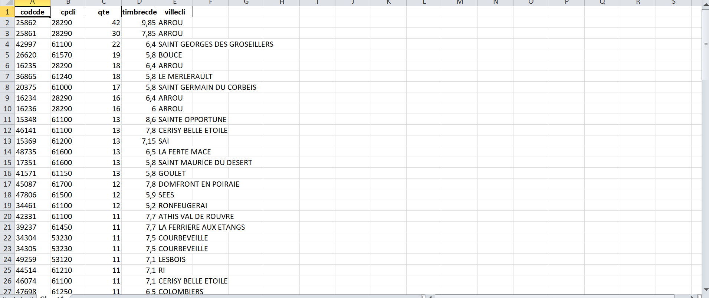

# LOT 1 : Filtrage, Agrégation et Classement (MapReduce)

Ce lot met en œuvre le framework **MapReduce** (via Hadoop Streaming) pour effectuer un filtrage ciblé sur les données et classer les commandes selon une double métrique.

---

## 1. Objectif du Lot

L'objectif principal du LOT 1 est de déterminer les **100 meilleures commandes** de la Fromagerie en appliquant des critères stricts et un classement complexe.

### 1.1 Critères de Filtration

Les données traitées par le Mapper doivent respecter les critères suivants :

- **Période** : Commandes passées entre le 01/01/2006 et le 31/12/2010.
- **Départements** : Commandes originaires des départements `53`, `61` et `28`.

### 1.2 Critères de Classement (Meilleure Commande)

Le classement est effectué par ordre de priorité :

1. **Priorité 1** : La plus grande somme des quantités d'articles (`qte`).
2. **Priorité 2** : La plus grande valeur de frais de timbre de commande (`timbrecde`).

---

## 2. Flux de Données et Algorithme MapReduce

L'analyse est divisée entre un **Mapper** qui effectue le filtrage, et un **Reducer** (assisté par Pandas) qui réalise l'agrégation, le classement et l'export final.

### A. Mapper (`mapper.py`)

Ce script utilise la librairie Pandas pour un traitement initial efficace du fichier CSV.

| Rôle                | Détails d'Implémentation |
|--------------------|-------------------------|
| **Lecture**         | Lecture de l'intégralité du `sys.stdin` (le fichier `dataw_fro03.csv`). |
| **Filtrage Temporel** | Filtrage direct sur la colonne `datcde` en utilisant la comparaison de chaînes pour les bornes > `"2005-12-31 00:00:00"` et < `"2011-01-01 00:00:00"`. |
| **Filtrage Géographique** | Filtrage sur la colonne `departement` pour inclure uniquement les valeurs `'53'`, `'61'`, `'28'` via `.isin(list)`. |
| **Émission**        | Pour chaque ligne d'article valide, émission des champs nécessaires pour l'agrégation. |

**Format d'Émission (Clé \t Valeur) :**  

---

### B. Reducer (`reducer.py`)

Le Reducer reçoit les données regroupées par `codcde` et procède à l'agrégation et au classement.

**Agrégation (`defaultdict`) :**

- Les données sont regroupées en mémoire à l'aide d'un `defaultdict` où la clé est la commande composite `(codcde, cpcli, villecli)`.
- La quantité (`qte`) est sommée pour obtenir le total des articles par commande.
- Le timbre de commande (`timbrecde`) est mis à jour (la dernière valeur rencontrée est conservée, correct car constante par commande).




**Classement (Pandas) :**

- Le dictionnaire agrégé est converti en DataFrame Pandas.
- Tri via :  
```python
df.sort_values(by=['qte', 'timbrecde'], ascending=False)

3. Livrables et Procédure d'Export
3.1 Export du Résultat

Format : Fichier Excel (df_sorted.to_excel).

Contenu : Les 100 meilleures commandes, incluant codcde, villecli, la somme des qte, et la valeur timbrecde.

Fichier généré : /datavolume1/top_100_commandes.xlsx (chemin configurable via --output).


3.2 Procédure d'Exécution (job.sh)

Le script job.sh encapsule l'ensemble des commandes nécessaires pour lancer le job Hadoop Streaming sur le cluster.


# 1. Préparation du HDFS
hdfs dfs -mkdir -p input
hdfs dfs -rm -r output/$OUTPUT_FILE # Nettoyage de l'ancienne sortie
hdfs dfs -put /datavolume1/$INPUT_FILE input # Copie du CSV vers HDFS

# 2. Lancement du Job Hadoop Streaming
hadoop jar /usr/local/hadoop/share/hadoop/tools/lib/hadoop-streaming-2.7.2.jar \
-file mapper.py -mapper "python3 mapper.py" \
-file reducer.py -reducer "python3 reducer.py" \
-input input/$INPUT_FILE \
-output output/$OUTPUT_FILE

| Composant  | Rôle dans `job.sh`                                     |
| ---------- | ------------------------------------------------------ |
| `-mapper`  | Exécute `mapper.py` sur les nœuds de données.          |
| `-reducer` | Exécute `reducer.py` sur les nœuds d'agrégation.       |
| `-input`   | Spécifie le fichier d'entrée HDFS (`dataw_fro03.csv`). |
| `-output`  | Spécifie le répertoire de sortie HDFS (`output/LOT1`). |
