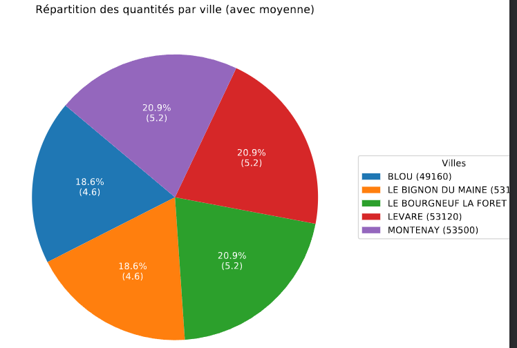

# LOT 2 : Analyse Ciblée, Échantillonnage et Visualisation Graphique

Ce document présente l'algorithme MapReduce et les étapes de post-traitement Python (Pandas/Matplotlib) mises en œuvre pour répondre aux objectifs du LOT 2.

---

## 1. Objectif

L'objectif du LOT 2 est triple :

1. Appliquer un filtrage strict sur une période et des départements spécifiques, incluant une contrainte sur le `timbrecli`.
2. Déterminer les 100 meilleures commandes au sein de cet échantillon filtré, en en extraire 5% aléatoirement.
3. Générer un graphe en secteurs (Pie Chart) montrant la répartition de la quantité d'articles par ville pour cet échantillon réduit.

---

## 2. Phase 1 : Filtration (Mapper)

Le script **Mapper** lit les lignes du fichier CSV en entrée (`sys.stdin`) et applique les filtres demandés.

### 2.1 Critères de Filtration

Le Mapper ne transmet au Reducer que les lignes d'articles qui satisfont simultanément toutes les conditions suivantes :

| Critère          | Champ(s)       | Plage/Valeurs Cibles | Logique d'Implémentation |
|-----------------|----------------|-------------------|-------------------------|
| Période          | datcde (Année) | [2011, 2016]      | Vérification si l'année est dans l'intervalle `ANNEE_MIN` et `ANNEE_MAX`. |
| Départements     | cpcli (Code Postal) | 22, 49, 53   | Extraction des deux premiers chiffres du code postal et vérification dans `DEP_CIBLES`. |
| Timbre Client    | timbrecli      | Non renseigné (vide/NULL) ou égal à 0 | Utilisation d'un `try/except float()` pour gérer les chaînes vides/NULL et vérifier la valeur numérique. |

### 2.2 Données Émises

Pour chaque article filtré, le Mapper émet une ligne structurée pour le Reducer/Post-traitement, contenant les informations nécessaires au calcul des statistiques par commande et par ville :

| Champ      | Explication |
|------------|------------|
| codcde     | Code de la commande (clé d'agrégation). |
| cpcli      | Code postal du client. |
| villecli   | Ville du client (pour le graphique). |
| libobj     | Nom de l'article. |
| qte        | Quantité de l'article (pour la somme). |
| timbrecde  | Timbre de la commande (pour le classement). |

---

## 3. Phase 2 : Agrégation et Échantillonnage (Post-traitement Python/Pandas)

La fonction `calculer_stats(df)` gère le classement complexe, l'échantillonnage, et l'agrégation finale.

### 3.1 Classement des Commandes (Meilleures Commandes)

- **Agrégation** : Le DataFrame est groupé par `codcde` pour calculer les mesures au niveau de la commande :
  - `qte` : somme des quantités d'articles par commande.
  - `timbrecde` : valeur unique du timbre de la commande.
- **Classement** : Les commandes sont triées selon le critère de "meilleure commande" :
  1. Priorité 1 : `qte` (décroissant)
  2. Priorité 2 : `timbrecde` (décroissant)
- **Top 100** : Seules les 100 premières commandes sont conservées.

### 3.2 Échantillonnage Aléatoire

Un échantillon aléatoire de 5% (`sample_size = max(1, int(len(top100) * 0.05))`) est tiré parmi ces 100 meilleures commandes.  
Ce sous-ensemble est utilisé pour l'analyse et la visualisation.

### 3.3 Statistiques Finales par Ville

Le sous-ensemble est réintégré aux lignes d'articles originales (`pd.merge`) puis regroupé par `villecli` et `cpcli` pour générer les mesures pour le graphique :

- `total_qte` : Somme totale des quantités des articles dans l'échantillon (poids du secteur).
- `avg_qte` : Moyenne des quantités des articles par commande dans l'échantillon.

---

## 4. Phase 3 : Visualisation et Export (Matplotlib)

La fonction `generer_graphique(ville_stats, output_path)` utilise la librairie Matplotlib pour créer et exporter le rapport visuel.

### 4.1 Caractéristiques du Graphe en Secteurs

| Caractéristique | Valeur |
|-----------------|--------|
| Poids (Taille des Secteurs) | `total_qte` (Quantité totale d'articles par ville) |
| Étiquettes | Nom de la ville et code postal (`villecli (cpcli)`) |
| Annotation | Chaque secteur affiche le pourcentage du total et, entre parenthèses, la moyenne des quantités par commande (`avg_qte`) |
| Titre | Répartition des quantités par ville (avec moyenne) |

### 4.2 Procédure d'Exportation

- Le graphique est exporté au format PDF en utilisant la classe `PdfPages`.
- Le chemin de sortie est configurable via l'argument de ligne de commande `--output` (par défaut : `/datavolume1/lot2_graphique_villes.pdf`).


---

## 5. Procédure d'Exécution Complète

Pour exécuter cette chaîne d'analyse MapReduce, les commandes suivantes sont utilisées sur l'environnement Hadoop/Linux :

```bash
# 1. Pipeline MapReduce et Post-traitement
# Le mapper applique le filtre, le cat simule le Reducer qui envoie au Post-traitement
cat /chemin/vers/dataw_fro.csv | \
python3 mapper_lot2.py | \
python3 reducer_lot2.py --output /datavolume1/lot2_rapport.pdf

# 2. Vérification du fichier exporté
ls -l /datavolume1/lot2_rapport.pdf


