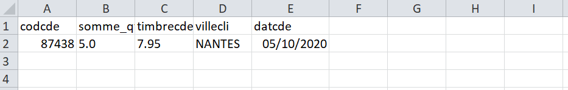
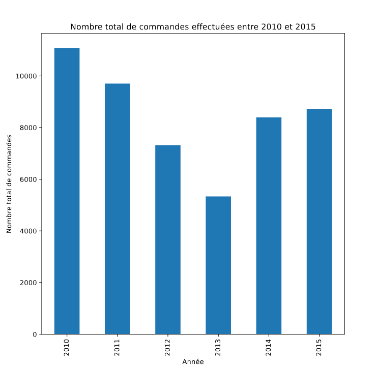

#  LOT 3 : Architecture HBase et Orchestration des Requêtes

Ce lot couvre la structuration des données en base NoSQL **HBase**, l'interrogation via des scripts **Python** modulaires, et l'export des résultats sous différents formats (**CSV, PDF, Excel**) pour l'analyse BI.

---

## 1. Architecture du Code et Configuration

### 1.1 Structure Modulaire

L'exécution des trois requêtes du LOT 3 est orchestrée par le script principal `main.py`, qui importe les fonctions analytiques de scripts dédiés, assurant ainsi la modularité du code.

| Fichier Python                  | Rôle                                                                                     | Requête(s) Associée(s) |
|--------------------------------|------------------------------------------------------------------------------------------|-------------------------|
| `main.py`                      | Orchestrateur. Gère la connexion HBase, appelle les fonctions de requêtes, et effectue les exports finaux. | Q1, Q2, Q3 |
| `meilleure_cde_nantes_2020.py` | Contient la logique pour la **Meilleure Commande** (filtrage 2020/Nantes et classement). | Q1 |
| `total_commande_2010_2015_par_annee.py` | Contient la logique pour le **comptage des commandes** et la génération du **Barplot PDF**. | Q2 |
| `extraire_client_max_timbre.py` | Contient la logique de **scan complet** et d’agrégation In-Memory pour identifier le **Top Client**. | Q3 |

---

### 1.2 Configuration et Connexion

La connexion à la base de données HBase est gérée par la librairie **HappyBase**.  
Les paramètres sont chargés à partir d'un fichier de configuration environnemental `.env` au démarrage du script.

| Paramètre    | Source | Description |
|--------------|--------|-------------|
| `HBASE_HOST` | `.env` | Nom d'hôte ou IP du serveur HBase (ex: `hadoop-master`). |
| `HBASE_PORT` | `.env` | Port d'écoute du **Thrift Server** (ex: `9090`). |
| `TABLE_NAME` | `.env` | Nom de la table HBase utilisée (`digicheese_data`). |

La connexion est ouverte une seule fois au début de `main.py`.  
L'objet `table` est ensuite passé aux fonctions analytiques, ou utilisé directement pour effectuer les scans.

---

## 2. Exécution et Résultats des Requêtes

Les trois questions sont exécutées séquentiellement : du **scan HBase** à l’**export des résultats**.

---

### 🔹 Q1 : Meilleure Commande de Nantes (2020)

| Étape       | Processus                                                                                         | Livrable |
|-------------|--------------------------------------------------------------------------------------------------|----------|
| Extraction  | `scan_to_dataframe` : récupération des colonnes (codcde, datcde, villecli, qte, timbrecde) depuis HBase. | CSV |
| Analyse     | `meilleure_commande_nantes_2020` : filtrage 2020 + Nantes, agrégation par `codcde`, classement par Quantité puis Timbre. | |
| Export      | Résultat (Top 1) exporté au format CSV.                                                           | `meilleure_commande_nantes_2020_hbase.csv` |

---

### 🔹 Q2 : Nombre total de commandes (2010–2015)

| Étape       | Processus                                                                                         | Livrable |
|-------------|--------------------------------------------------------------------------------------------------|----------|
| Extraction/Filtre | `filtre_hbase_2010_2015` : récupération des commandes + dates, avec filtre possible sur Row Key par année. | PDF |
| Analyse     | `total_commande_par_annee_2010_2015` : conversion en DataFrame + comptage des commandes uniques par année. | |
| Visualisation | `plot_resultat_total_commande_par_annee` : génération d’un **Barplot Matplotlib**. | |
| Export      | Graphe exporté au format PDF.                                                                    | Fichier défini dans le script Q2 |

---

### 🔹 Q3 : Top Client (max frais de timbre)

| Étape       | Processus                                                                                         | Livrable |
|-------------|--------------------------------------------------------------------------------------------------|----------|
| Extraction/Agrégation | `extraire_client_max_timbres` : scan complet HBase. Agrégation (total_timbre, nb_commandes, total_qte) en mémoire par `idcli`. | Excel |
| Classement  | Sélection du client ayant le **plus grand total_timbre** via `max()`. | |
| Export      | Résultats formatés dans un DataFrame Pandas puis exportés.                                        | `client_max_timbre.xlsx` |

---

## 3. Sortie des Livrables

Tous les fichiers générés sont stockés dans le répertoire :

### Fichiers produits :

-  `./Lot3/output/meilleure_commande_nantes_2020_hbase.csv`  
-  `./Lot3/output/client_max_timbre.xlsx`  
-  PDF généré par `plot_resultat_total_commande_par_annee`

---

## Suggestions d’Amélioration

- Les scripts sont plutôt longs à exécuter.  
- Une amélioration possible serait de **réaliser certains filtres directement dans la base de données (HBase)** afin de réduire le volume de données transférées et ainsi accélérer le traitement.  
- Pour aller plus loin, on pourrait envisager d’utiliser **Apache Spark** au lieu de simples jobs MapReduce, afin de bénéficier d’un traitement distribué plus rapide et d’une meilleure intégration avec les outils BI.
